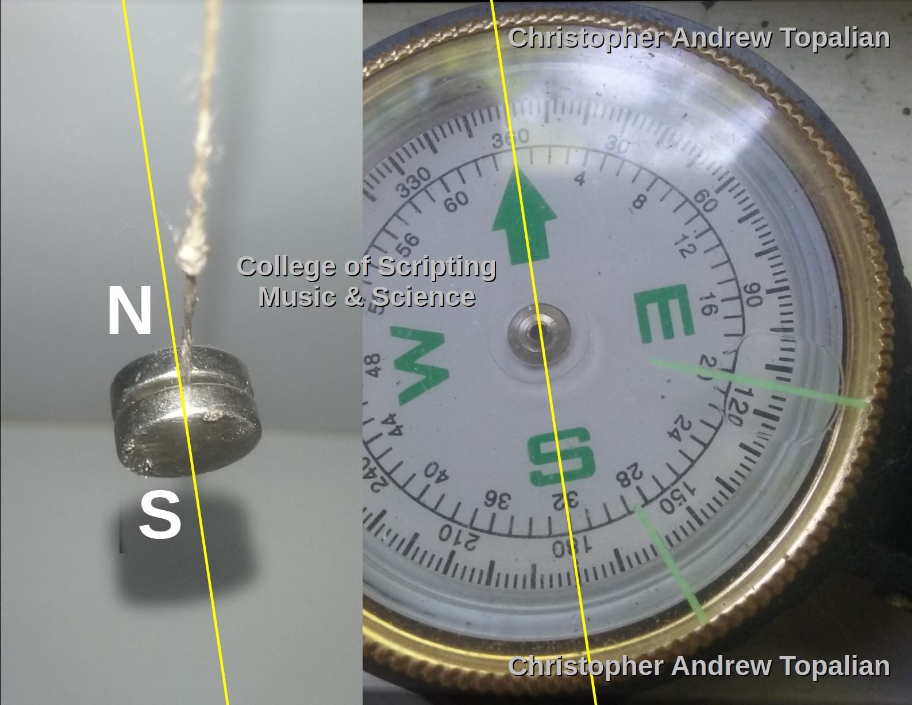

# Determine Poles of  the Magnet

  

## We use a COMPASS to Determine the Direction of the North Pole, which is in reality the SOUTH MAGNETIC POLE OF EARTH

## We hang two neodymium MAGNETS using a thin THREAD  

## The North Pole of our Magnet is the SIDE that points where the Compass Needle Points!

## The North pole of our magnet is ATTRACTED to the South Pole of Earth, which is located at the geographic North Pole.

## We can use a Piece of Paper or a Marker to Label Each Side of the Magnet as N and S for NORTH and SOUTH  

---

//----//

// Dedicated to God the Father  
// All Rights Reserved Christopher Andrew Topalian Copyright 2000-2025  
// https://github.com/ChristopherTopalian  
// https://github.com/ChristopherAndrewTopalian  
// https://sites.google.com/view/CollegeOfScripting  

