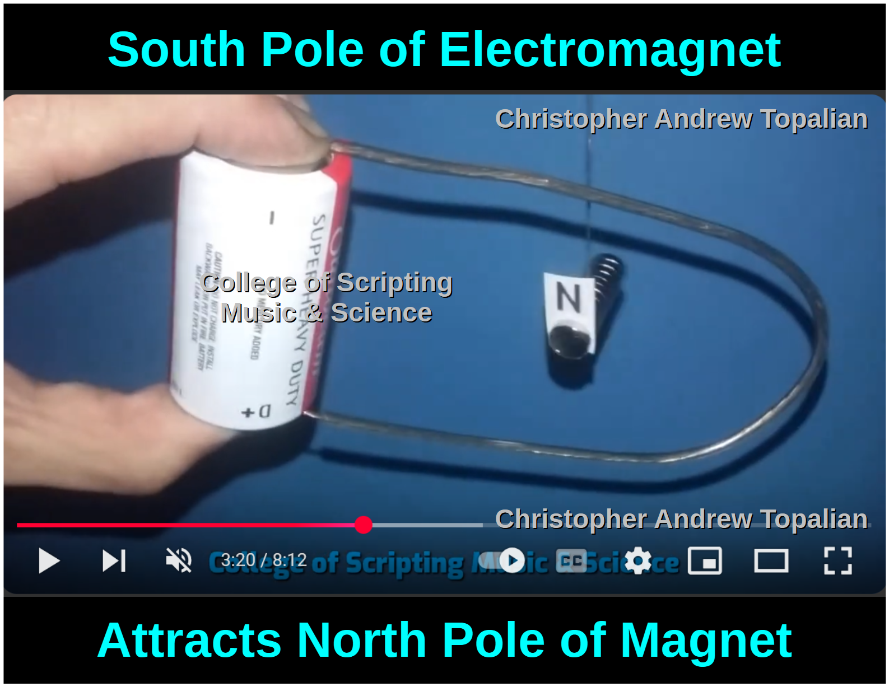
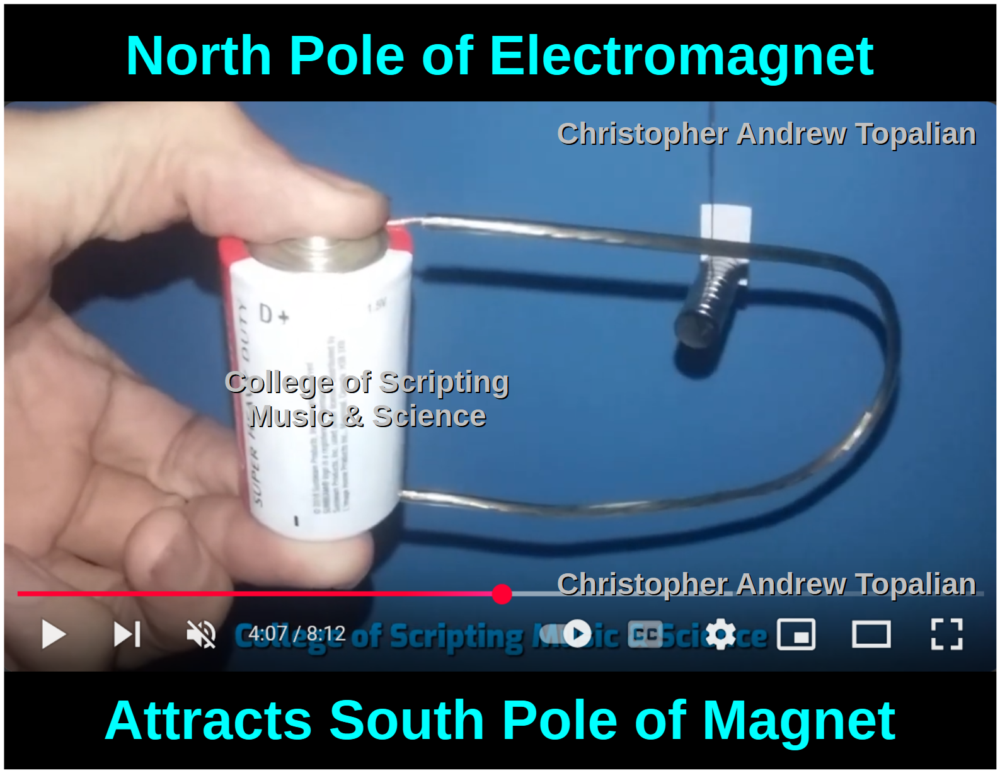
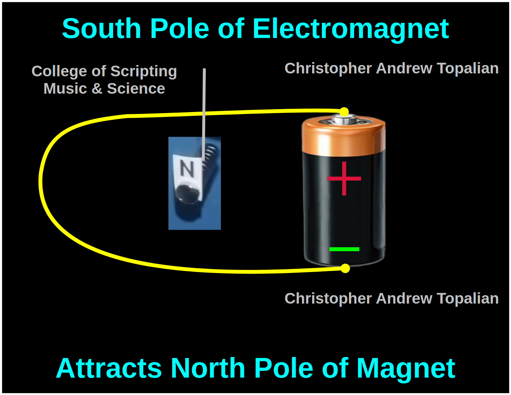
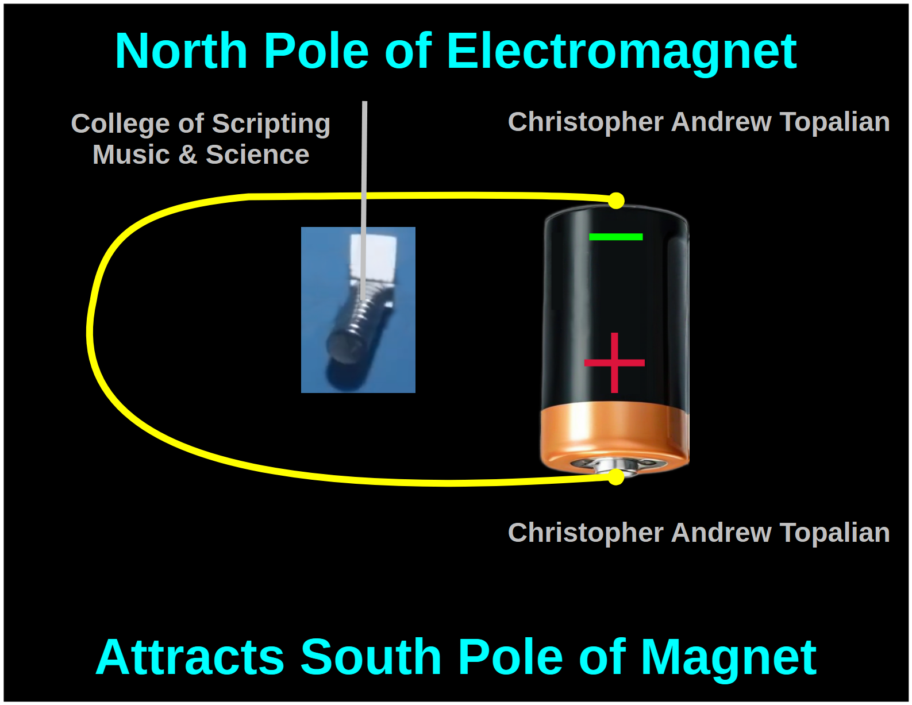

# Electromagnetism

# Video:
https://www.youtube.com/watch?v=YgNt1kRxzt0 

### SOUTH POLE - A
  

### NORTH POLE - A
  

---

# What Happens when we Turn the WIRE LOOP 180 Degrees Horizontally?

### SOUTH POLE - B
  

### NORTH POLE - B
  

//----//

// Dedicated to God the Father  
// All Rights Reserved Christopher Andrew Topalian Copyright 2000-2025  
// https://github.com/ChristopherTopalian  
// https://github.com/ChristopherAndrewTopalian  
// https://sites.google.com/view/CollegeOfScripting  

