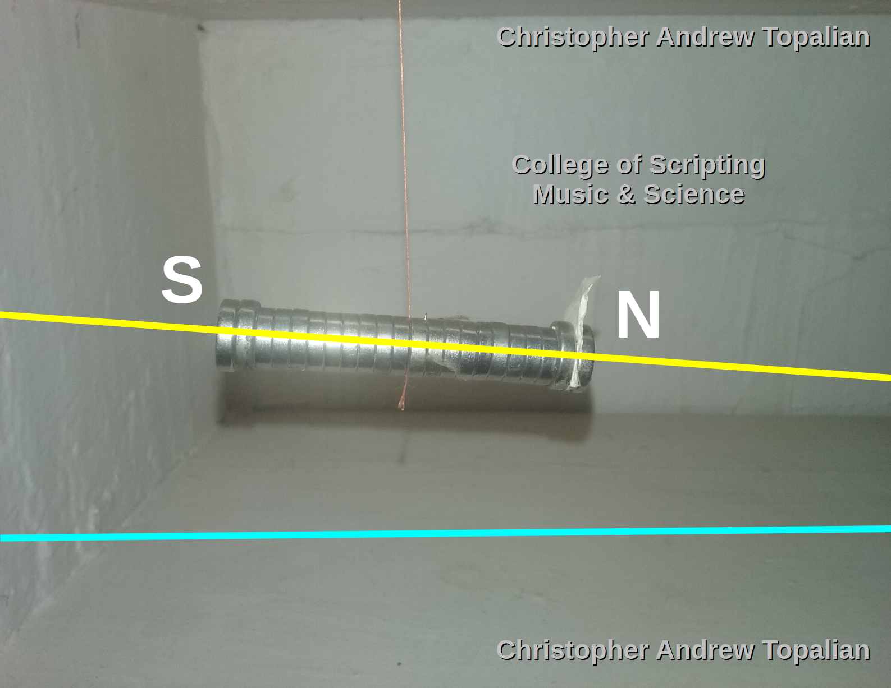

# Magnetic South Pole is Inside of Earth

  

---

The magnetic south pole is located INSIDE of the Earth deep down!

Notice how the Magnet is TILTING downward!

---

# 📘 Magnetic Declination and Dip of Neodymium Magnet in Free Suspension  
**Christopher Andrew Topalian — College of Scripting, Music & Science**  
**Project: CA Topalian Science Electromagnetism**  
**Tutorial: Measuring Magnetic Dip Angle in Flat Earth Cosmology**

---

## 🧲 Objective

This experiment demonstrates the **natural tilt (dip)** of a suspended, balanced neodymium magnet in the Earth's magnetic field. The observation reveals a **distinct downward angle** of the North-seeking pole (labeled **N**) toward what is commonly referred to as the "Magnetic South Pole" — located *geographically* in the Arctic region.

We document this tilt to study the nature of the **magnetic field lines**, their angular penetration into the Earth, and to consider **alternative cosmological interpretations**, such as a central magnetic anchor or "Black Sun" model within Flat Earth theory.

---

## 🧪 Experimental Setup

- **Magnets Used:** 22 cylindrical neodymium magnets, stacked into a rod.
- **Suspension:** A single fine thread was inserted and clamped at the central magnet before rejoining the stack.
- **Location:** North East, USA.
- **Environment:** Low-draft interior space with magnetic interference minimized.
- **Observation:** Magnet naturally rotated and rested at a downward tilt.

---

## 📏 Angular Analysis

Using the attached image for visual reference, we observe:

- The **horizontal cyan reference line** represents a level, neutral axis.
- The **yellow line** represents the aligned magnetic dip of the magnet stack.
- The **measured tilt** from horizontal is approximately **68–72 degrees** downward on the North pole side (note: angle estimate from pixel geometry).

This angle — known scientifically as the **"magnetic dip"** or **"inclination"** — varies by location. In North East USA, this value closely matches established magnetic dip maps, supporting that the magnetic field lines penetrate the Earth at steep downward angles in northern regions.

---

## 🌌 Interpretation in Flat Earth Cosmology

In Flat Earth scientific interpretation:

- The strong downward tilt suggests that a **massive magnetic attractor exists beneath the Arctic**, near the central axis of the Earth plane.
- The location is not a "pole" in spherical terms but a **central subterranean vortex** of magnetic force.
- This attractor — whether **core, magnetic well, or "black sun"** — may act as the **source of the toroidal magnetic field** enveloping the flat Earth plane.
- The torus field wraps around and returns out through the southern circumference, forming the **complete magnetic loop**.

This naturally leads to the theory that:

> 🧲 *"The Earth itself may be suspended in a magnetic prism, anchored by a central attractor — possibly the 'Black Sun' — that sits at the core beneath the plane, pulling the field lines into a toroidal loop and shaping the very magnetic world we live in."*

---

## 💬 Discussion

This result raises exciting questions:

- **Is the center of Earth also the center of the toroidal field?**
- **Is this force acting like a black hole with magnetic rather than gravitational dominance?**
- **Does the strong dip indicate vertical magnetic penetration from an underground attractor or interdimensional boundary?**

This tutorial provides real-world evidence of a central pulling force, measurable and repeatable with simple materials.

---

## 🔚 Conclusion

The strong downward dip of a magnet freely suspended over North East USA confirms the directional force of Earth's magnetic field. Interpreted through Flat Earth cosmology, this points to a powerful **magnetic central engine** beneath the Earth — a potential **Black Sun** or field anchor — drawing magnetic lines inward, shaping the very nature of our electromagnetic environment.

Further experiments should be conducted at different latitudes to map the dip variation across the Earth plane and refine estimates of the depth and location of this central force.

---

*End of Tutorial #2: Magnetic Inclination & the Central Attractor*

---

//----//

// Dedicated to God the Father  
// All Rights Reserved Christopher Andrew Topalian Copyright 2000-2025  
// https://github.com/ChristopherTopalian  
// https://github.com/ChristopherAndrewTopalian  
// https://sites.google.com/view/CollegeOfScripting  

