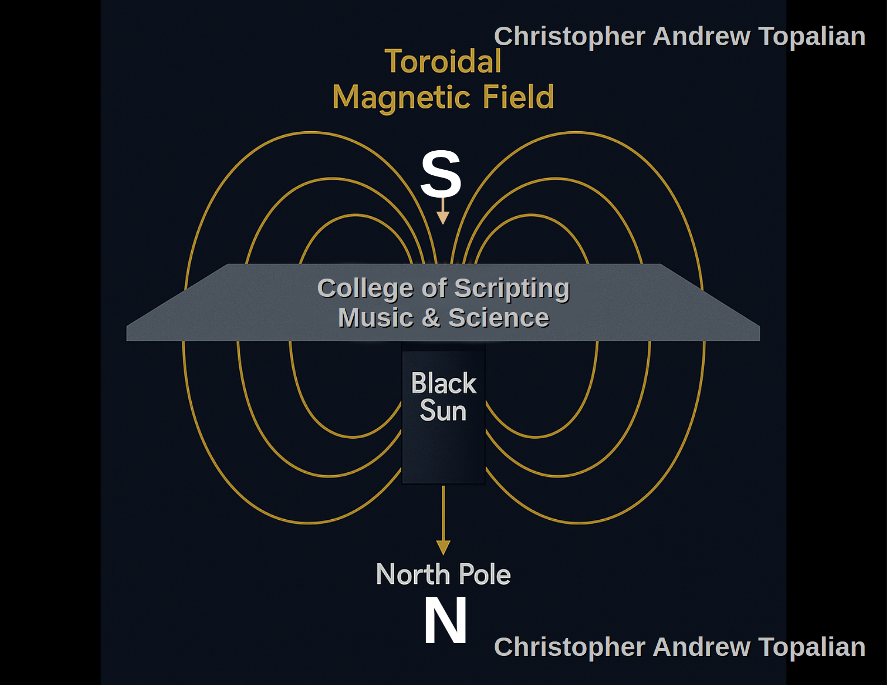

**Relationship between position on the Earth plane and the magnetic dip angle**

  

---

# 📘 Magnetic Dip and Positional Inclination on the Flat Earth Plane  
**Christopher Andrew Topalian — College of Scripting, Music & Science**  
**Project: CATopalian Science Electromagnetism**  
**Positional Distance and Magnetic Dip Interpretation**

---

## 🌍 Location Note

This experiment was conducted in the **northeastern region of the continental United States**.  
While magnetic inclination can vary slightly between nearby states, the changes are typically within a few degrees. For the purposes of this tutorial, it is scientifically sound and appropriately private to simply note:

> 📌 *“Experiment conducted in the Northeastern U.S.”*

This notation respects personal privacy while preserving geographical relevance for scientific replication and analysis.

---

## 🧭 Flat Earth Cosmology and Magnetic Inclination

In traditional physics, magnetic field lines are thought to originate from a central core and arc out in three-dimensional space. However, in **Flat Earth magnetic theory**, we reinterpret this phenomenon with a grounded logic based on planar physics and radial magnetic influence.

- The magnetic field creates a **toroidal pattern**, wrapping from the outer edge, returning to the central attractor.

---

## 🔽 Magnetic Dip: Why It Changes with Distance

### 🌌 Core Observation

As a magnet is suspended on a thread at different locations on the Earth plane, it dips downward more or less depending on how **close it is to the center** — the magnetic attractor, or what we call the **Black Sun**.

---

### 🧠 Flat Earth Logic

> 💡 The **closer** you are to the center (the Black Sun), the **steeper** the downward tilt (dip) of the North-seeking pole.  
> 💡 The **further** you are from the center, the **flatter** the tilt, because the vector to the center requires a shallower angle from a greater distance.

This can be visualized as a radial ramp:

- Near the center, field lines dive sharply downward.
- At greater distances, they must stretch diagonally toward the center, forming a **lower angle of inclination**.

---

### 📊 Real-World Match

Magnetic inclination maps used by surveyors and navigators show this exact pattern:

- Near the geographic **Arctic region** (center), the magnetic dip is nearly **90 degrees** downward.
- Near the **equatorial band**, the dip approaches **0 degrees** — field lines are horizontal.
- Near the outer **circumference** of the Earth plane (Antarctic circle), the dip **reverses** — the South-seeking pole now points downward, completing the toroidal field.

These patterns **match the Flat Earth interpretation**, where:

> ✨ *“The further outward one travels from the magnetic center, the shallower the apparent dip becomes, until it levels — then reverses as it returns inward from the opposite side.”*

---

## 📐 The Geometry of Dip on the Plane

Let us define:

- Let `d` be the radial distance from the magnetic center.
- Let `θ(d)` be the magnetic dip angle.
- As `d → 0` (approaching the center), `θ(d) → 90°`
- As `d → edge`, `θ(d) → 0°`, then to `−90°` in the outer ring.

This simplified equation models the geometry:

```

θ(d) ≈ 90° \* cos(π \* d / D)

```

Where:

- `D` = maximum radial distance to edge of the magnetic plane
- `d` = observer’s distance from center

*(Note: This is a conceptual, not empirical, formula for educational demonstration.)*

---

## 🧲 The Black Sun Hypothesis

We call the central attractor the **Black Sun**, a magnetic entity or vortex-like force anchored at the center of the Earth plane.

It behaves as:

- A **field generator**, pulling magnetic lines inward.
- A **plane stabilizer**, keeping the field coherent.
- A **directional reference**, explaining compass orientation and dip.

Rather than a physical sun, it is theorized to be a **toroidal anchor**, akin to the center of a magnetic donut or a simulated singularity — though not destructive, but **life-organizing**.

---

## 🧪 Suggested Follow-Up Experiments

To further test this concept:

- Conduct identical magnet suspension tests at different radial distances.
- Record the dip angle with a protractor or calibrated inclinometer.
- Plot results as a function of distance from the magnetic center.

This would provide **flat Earth-compatible data** for modeling the radial dip gradient and refining estimates of field symmetry.

---

## 📷 Visual Reference

(Refer to previously uploaded image or future dip-mapping images to compare angle.)

---

## 🧾 Conclusion

This tutorial describes how magnetic dip varies by distance from the central attractor (Black Sun) on the Earth plane. In Flat Earth cosmology, this variation is **not due to curvature**, but rather to the **distance-based angular pull** toward the center of the toroidal magnetic field.

By comprehending this inclination pattern, we gain new insight into both natural magnetism and the structure of our inhabited plane.

---

*Tutorial: Positional Inclination on the Flat Earth Plane*

---

//----//

// Dedicated to God the Father  
// All Rights Reserved Christopher Andrew Topalian Copyright 2000-2025  
// https://github.com/ChristopherTopalian  
// https://github.com/ChristopherAndrewTopalian  
// https://sites.google.com/view/CollegeOfScripting  

