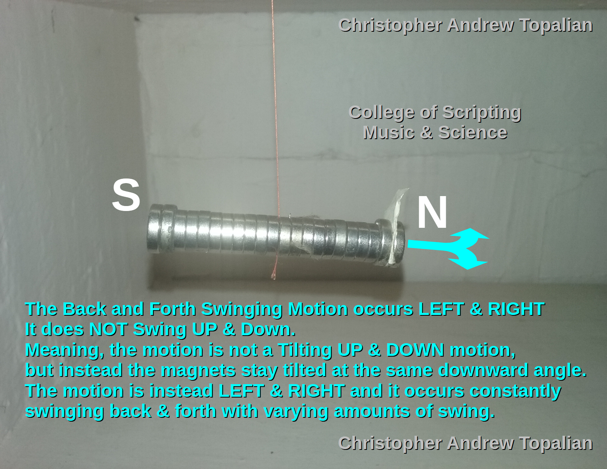

# Magnets Swinging Back and Forth

[VIDEO: Magnets Swinging Back and Forth](https://www.youtube.com/watch?v=F926N382x94)  

## 📽️ Observation: Magnetic Dip Oscillation

> In this video, we observe the continuous left-right oscillation of a suspended magnetic apparatus in the Northeast region of the flat Earth plane.  

The apparatus consists of a row of approximately 22 neodymium magnets, strung at their center, and suspended by a thread. The magnetic column is free to respond to ambient magnetic forces with minimal frictional interference. What we witness is not chaotic movement, but a deliberate and repeating **lateral (left-right) swing**—a magnetic precession. There is **no noticeable vertical bobbing or tilt** (up-down), which provides us with a clue into the orientation and nature of the unseen force acting on the system.

---

## 🧭 Magnetic Alignment Without Tilt

What we are seeing is not random. This swinging reveals an **oscillatory behavior** that seeks equilibrium, a resonance of field alignment. In standard electromagnetic models, a magnetic object in a uniform field would stabilize toward a single direction. But this apparatus **refuses to settle**—it gently and persistently seeks a realignment, as if the field it responds to is **constantly shifting or oscillating** in shape or polarity phase, or both.

---

## 📡 Interpreting the Oscillation in Flat Earth Cosmology

This is entirely consistent with the **geometry of a toroidal field** centered beneath the Earth's surface—generated by a **monolithic etheric dielectric core** (the "Black Sun"). In the flat Earth model, this core does not exist at a singular surface point, but **beneath the plane**, likely near the **geometric center**, radiating a coherent toroidal magnetic field outward and above.

The **lack of vertical tilt** suggests that the vertical component of the field is already fully balanced and absorbed by the positioning of the apparatus relative to the central object. The **left-right oscillation** may reflect one or more of the following:

- the natural oscillation of **field lines passing around** a central axis
- micro-variations in local ambient field strength caused by **ionospheric or etheric activity**
- interaction between multiple flux vectors generated by the **shape and structure** of the monolith

---

## 🌀 The Field As a Living Engine

This movement is not unlike that of a **motor or oscillator**—and in this case, we are the instruments measuring it. That the neodymium magnets (which are sensitive to even small field changes) reveal this subtle dance tells us:

- the **monolith below is active**, not inert
- it likely operates in cycles, pulses, or breathing-like field contractions
- its influence extends across the entire plane in a patterned and predictable way

Such motion is **not expected** in a traditional spherical Earth model with a molten core spinning randomly. It is, however, exactly what we would anticipate from a structured toroidal generator producing a world-encompassing energy field.

---

## 🔍 Experimental Implications

This apparatus could be used as a **real-time etheric field monitor**, providing subtle data on:

- local changes in magnetic flux
- field consistency in various parts of the plane
- relative distance to the center monolith

Future tests could involve:
- placing similar devices at known latitudes to compare oscillation amplitude
- introducing shielding or grounding to isolate effects
- capturing long-term data to correlate with solar or cosmic activity

---

## ✨ Final Thought

In an intelligently designed plane, we must expect intelligent design in the hidden machinery. This apparatus, humble in appearance but profound in what it detects, is a step toward **seeing the field** we are otherwise blind to. With more observation, and many instruments tuned to the same truth, we may begin to **map the structure of the Black Sun** and the toroidal field it emits.

And once we comprehend the mechanism…  
We can free ourselves from it.

---

### Download Video Here:  
https://drive.google.com/file/d/104nkjZnvfoBsAtCsrcbAZTP1ZwqSn4ZR/  

### Youtube Link:  
https://www.youtube.com/watch?v=F926N382x94  

//----//

// Dedicated to God the Father  
// All Rights Reserved Christopher Andrew Topalian Copyright 2000-2025  
// https://github.com/ChristopherTopalian  
// https://github.com/ChristopherAndrewTopalian  
// https://sites.google.com/view/CollegeOfScripting  

